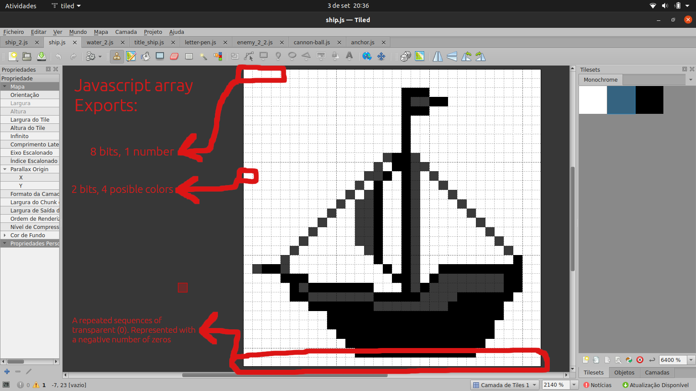

# Coding Reference

## Overview

The image below represents the game function call sequence.


The first thing that will be executed on the game script is the ```Enable Audio?``` modal.
It was made with the native javascript DOM API. After clicking any button, the bootstrap 
function will be executed. If the ```Yes``` button were chosen, the audio tag would be created
and its reference would be stored in the ```GAME_STATE``` object.

The ```GAME_STATE``` object contains all the game assets like images (sprites) and sounds (midis).
The images have a specific format for the game. It will be documented below.

After the canvas element creation and the main menu scene creation, all the game images will be
decompressed. The decompression will generate a number array that represents the image bitmap
matrix. With that information, each image will be drawn at a hidden canvas and transformed into
a png using the ```canvas.toDataUrl``` method. That png images will be stored at the user memory
before tha game starts (in ```GAME_STATE``` object). This process is fast on modern machines. A 
loading screen is not necessary.

With the main canvas element created and the images decompressed, the first scene will be created.
The ```createScene``` function receives a number constant wich represets the scene to be created.
The ```GAME_STATE``` object contains two arrays: ```texts``` and ```sprites```. Each scene contains
their own sprites (animated images) and texts own their owns positions (x and y). The method ```createScene```
initializes it for the scene. New text and sprites could be added or removed during a scene.

The next step after the scene initialization is the ```calc and render loop```. 60 times per second the
function calc and the function render will be called. The calc contains the scene logic like "if the 
cannon ball collides with the enemy, remove the enemy sprite and add the explosion sprite". Each scene
has its own calc method. The render method is the same for all the scenes, it will """just""" render the texts and
the sprites on its current frames and positions on the screen.

## Types (duck typed)

The texts and sprites object structures are represented on the image below:


Obviously, the props x and y represent the position of the element on the screen. Res is the resolution with
width and height. All the values are represented in pixels. The visible prop is optional, the render method
will not render it if it is ```=== false```. The frames array is the collection of all images of the animation.
The frame prop is the current frame of animation. It is optional, if the frame prop has not been set, the current frame
will be ```0```.

## Images

The images were drawn with ```Tiled``` software. This software was not made for images, it is properly used for
tileset maps. Yet it is the free software tool i had at hands. [This video](./tiled-drawing.mp4) shows how an image could be
easily drawn with it.

Tiled maps could be exported as javascript. This script contains the bitmap represented as an Javascript array. In the game images
just 3 types of colors were used for each images. It was drawn with black and white. The map matrix contains 3 types of values:
0 (transparent), 1 (grey) and 2 (black). 4 different numbers can be represented with 2 bits:

 - 00: zero
 - 01: one
 - 10: two
 - 11: three (unused on the game)

 It means that in 8 bits of code, we can store 4 pixels. The image compression works in that way. 
 The image below represents the game function call sequence:

 

The repeated sequences of zeros (transparent) could be represented by a negative number, on javascript.
The script ```assets-src/map-to-monochrome-image.js``` contains one script to transform ```Tiled``` map into this compressed array.
It could be executed on ```nodejs``` or ```Chrome developer tools```. The first variable of the script can be replaced by the Tiled
image.

The colors of each images were set in the ```GAME_ASSETS``` aside of the image array. The property ```c1``` is the hexadecimal color
that will replace the grey and the ```c2``` replaces the black. The zero is just transparent. These properties are optional, if they 
are not set, the colors will be grey and black.

The property ```generateInverted``` is also optional. If it were set, the png mirrored version of the image would be generated once the 
game starts.


